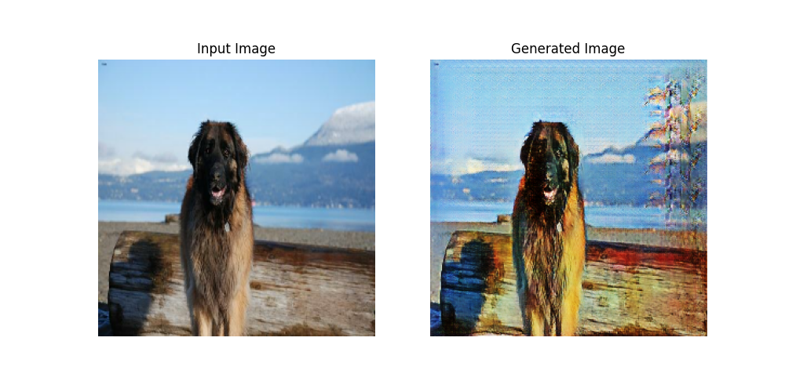

# PetsArtistGAN: Generating Art-Influenced Pet Portraits with CycleGAN
This Deep Learning project utilizes the CycleGAN to produce captivating pet portraits influenced by various artistic styles from various different eras. By leveraging the power of generative adversarial networks (GANs), PetsGAN transforms ordinary pet images into visually striking compositions reminiscent of renowned art movements, allowing pet owners to create simple images of their pets into canvas-like portraits. 

As training the model is quite computationally expensive, currently only the pre-training of the model on all styles present in the art styles dataset(link below) and the Oxford pets dataset was conducted. However, a next step would be to fine-tune this model on a smaller dataset of pet/art images coming from a single style or artist.


# PetsGAN Model Architecture

The architecture of the PetsGAN model consists of two generators and two discriminators, implemented using TensorFlow/Keras. Below is a summary of the model's layers and parameters:

| **Layer (type)**          | **Output Shape**     | **Param #**    |
|---------------------------|----------------------|----------------|
| Generator_Pet2Art (Functional)| (None, 256, 256, 3) | 54,414,979     |
| Generator_Art2Pet (Functional)| (None, 256, 256, 3) | 54,414,979     |
| Discriminator_pet (Functional)| (None, 30, 30, 1)    | 2,765,569      |
| Discriminator_art (Functional)| (None, 30, 30, 1)    | 2,765,569      |

**Total params**: 114,361,096 (436.25 MB) \
**Trainable params**: 114,361,096 (436.25 MB) \
**Non-trainable params**: 0 (0.00 Byte)

The model architecture includes two generators responsible for transforming pet images into art-styled pet images and vice versa. Additionally, there are two discriminators for distinguishing between real and generated images in both the pet and art domains. The total number of parameters in the model is 114,361,096, with all parameters being trainable.

# Scripts

- code/gets_pets_ds.py: Downloads and save the OxfordPets dataset for processing.

- code/model.py: Module containing the PetsArtistGAN model code.

- code/test_inference.py: Containts inference code to test a trained model on a jpg image as:
```
python ./code/test_inference.py --model <YOUR_MODEL_DIR> --input-image <JPG_IMAGE> --save-gen (Optional flag to save the generated image)
```

- code/lr_strategy.py: Helper script just providing a visualization and explanation or the lr strategy used. Inspired by the original CycleGAN paper.

- code/train.py: Script containing training code.

# Notebooks
- art_dataset.ipynb: Jupyter Notebook containing all the art styles dataset pre-processing/exploration code. Used to generate the train/val splits for the art styles dataset.
- google_collab/PetsGAN.ipynb: Jupyter Notebook to train the model on Google Collab

# Datasets
In order to create the training and validation sets to train our PetsArtist
model from scratch, run follow the steps below.

### Step 1: Download and generate the Oxford Pets dataset from Tensorflow-Datasets
```
python ./code/get_pets_ds.py
```

### Step 2: Create the Art styles dataset as you see fit:
You can use the dataset generator provided in *./code/art_dataset.ipynb* to create the art styles dataset after downloading it from Kaggle.

**Art dataset source**: https://www.kaggle.com/datasets/ikarus777/best-artworks-of-all-time


### Step 3: Merge the datasets and prepare the PetsGAN_train dataset:

1. **Create the New Dataset Directory:**
   ```bash
   mkdir datasets/PetsGAN_train
   mkdir datasets/PetsGAN_train/art
   mkdir datasets/PetsGAN_train/pets
   ```

2. **Copy art dataset images:**
   ```bash 
   cp -r datasets/art_dataset/train/* datasets/PetsGAN_train/art/
   ```

3. **Copy pet dataset images:**
   ```bash
   cp -r datasets/oxford_pets/train/*/* datasets/PetsGAN_train/pets/
   ```

Now your newly created training dataset should look like this:

```
datasets/PetsGAN_train/ 
├── art_dataset 
│   └── train 
│       ├── art_image1.jpg
│       ├── art_image2.jpg 
│       └── ... 
└── oxford_pets 
    └─ train 
        ├── Abyssinian 
        │   ├── Abyssinian_1.jpg 
        │   ├── Abyssinian_2.jpg 
        │   └── ... 
        ├── Bengal 
        │   ├── Bengal_1.jpg 
        │   ├── Bengal_2.jpg 
        │   └── ... 
        ├── ... 

```
4. **Create the testing and validation sets**
- Testing set should contain images only from the pet domain as we will
be evaluating the quality of the generated images against the original ones.
```bash 
mkdir datasets/PetsGAN_test
cp -r datasets/oxford_pets/test/*/* datasets/PetsGAN_test/
```
- For validation set we will be using the remaining images
```bash 
mkdir datasets/PetsGAN_validation
mkdir datasets/PetsGAN_validation/art
mkdir datasets/PetsGAN_validation/pets
cp -r datasets/art_dataset/validation/* datasets/PetsGAN_validation/art/
cp -r datasets/oxford_pets/validation/*/* datasets/PetsGAN_validation/pets/
```


# Some results
These results were made with a model trained on the full PetsGAN_train dataset for 70 epochs with a batch size of 16 and a constant lr of 2e-4.





# References 
1. [Unpaired Image-to-Image Translation using Cycle-Consistent Adversarial Networks](https://arxiv.org/abs/1703.10593) (Original CycleGAN paper)
